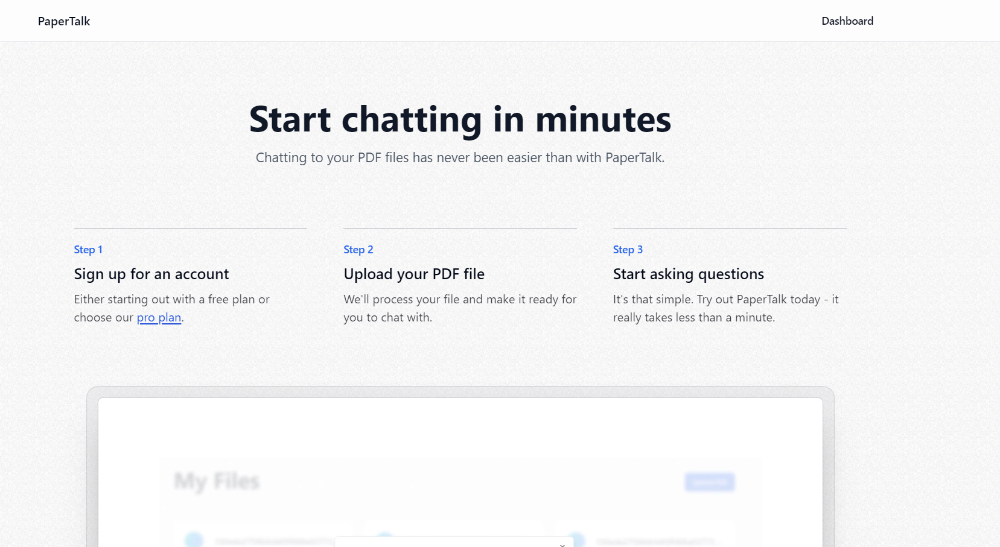
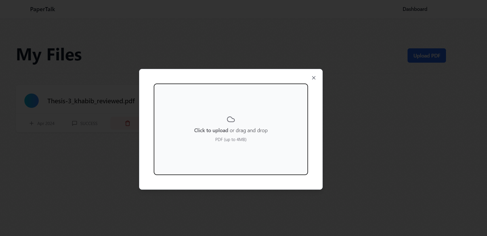
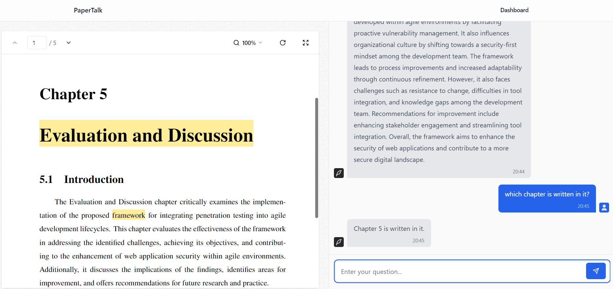

# PaperTalk

Chat with your documents in seconds.
PaperTalk allows you to have conversations with any PDF document. Simply upload your file and start asking questions right away.

### Technologies:

- React, Tailwind - Development
- OPENAI API - To chat with PDF
- Langchain - To read and vectorize PDF
- Postgresql - To store data
- Kinde - For Authentication
- Uploadthing - to Upload files
- PineCone api - to store vectors


## Getting Started

First, run the development server:

```bash
npm run dev
# or
yarn dev
# or
pnpm dev
# or
bun dev
```

To Sync database with prisma
```
>>> npx prisma db push

>>> npx prisma generate                                                                                                 
```

Open [http://localhost:3000](http://localhost:3000) with your browser to see the result.

http://localhost:3000/api/auth/login?

## Demonstration

Main Page:


Dashboard:



Chat Page:


